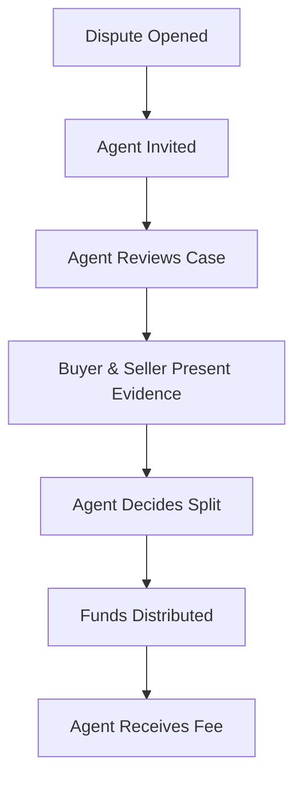

## The Role of Agents

Agents are **professional arbitrators** who resolve disputes between buyers and sellers when they can't agree.

<Card title="Think of it like..." icon="scale-balanced">
  An agent is like a judge for your escrow. When there's a disagreement, they review the evidence and make a fair decision.
</Card>

---

## How Agents Work



### Key Responsibilities

- 📋 **Review disputes** — Examine terms, evidence, and communications
- ⚖️ **Make fair decisions** — Determine how to split escrowed funds
- ⏰ **Respond promptly** — Act within 7 days of being invited
- 🎯 **Stay neutral** — No relationship with either party

---

## Why Stake?

Agents must **stake funds** to participate. This creates accountability:

<CardGroup cols={2}>
  <Card title="Skin in the Game" icon="piggy-bank">
    Agents risk their own money if they misbehave.
  </Card>
  <Card title="MAV Limits" icon="chart-line">
    Stake determines the maximum escrow size they can handle.
  </Card>
  <Card title="Economic Alignment" icon="handshake">
    DAO token stake shows commitment to the protocol.
  </Card>
  <Card title="Slashing Risk" icon="scissors">
    DAO can slash stakes for proven misconduct.
  </Card>
</CardGroup>

---

## What Agents Earn

Agents earn fees for their services:

| Fee Type | When Earned | Typical Range |
|----------|-------------|---------------|
| **Assignment Fee** | When selected for an escrow | 0-2% |
| **Dispute Fee** | When resolving a dispute | 1-10% |

<Note>
Most income comes from dispute fees. Assignment fees are optional upfront payments.
</Note>

### Example Earnings

```
Escrow: $10,000
Dispute Fee: 5%

Agent resolves dispute...
Agent earns: $500
```

---

## Agent Selection

Users choose agents when creating escrows. Selection criteria:

<AccordionGroup>
  <Accordion title="Reputation" icon="star">
    Number of disputes resolved, time as agent, community feedback.
  </Accordion>
  <Accordion title="MAV" icon="coins">
    Maximum escrow value the agent can handle (based on stake).
  </Accordion>
  <Accordion title="Fees" icon="percent">
    Assignment and dispute fees set by the agent.
  </Accordion>
  <Accordion title="Availability" icon="calendar-check">
    Whether the agent is currently accepting new cases.
  </Accordion>
</AccordionGroup>

---

## Agent Validation

Agents are validated at two points:

### At Escrow Creation

- Is this agent registered?
- Is their MAV ≥ escrow amount?
- Are they active and available?

### At Agent Invite

Same checks run again. This prevents:
- Agents unstaking after being selected
- Multiple high-value disputes draining MAV

---

## What If An Agent Misbehaves?

The DAO provides oversight:

| Issue | Response |
|-------|----------|
| Clearly biased decision | DAO investigation, possible slashing |
| Accepting bribes | Heavy slashing, potential ban |
| Repeatedly slow responses | Reputation damage, reduced selection |
| Abandoning cases | Timeout mechanism, reputation hit |

<Warning>
Agents cannot be punished for making difficult but fair decisions. The DAO only acts on clear misconduct.
</Warning>

---

<Card title="Want to Become an Agent?" icon="gavel" href="/agents/becoming-an-agent">
  Learn how to register →
</Card>
