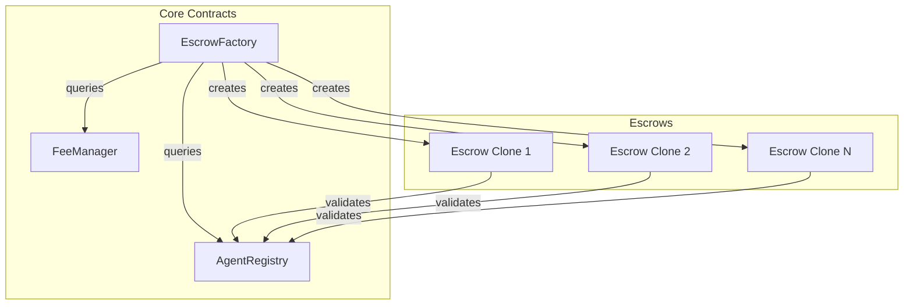
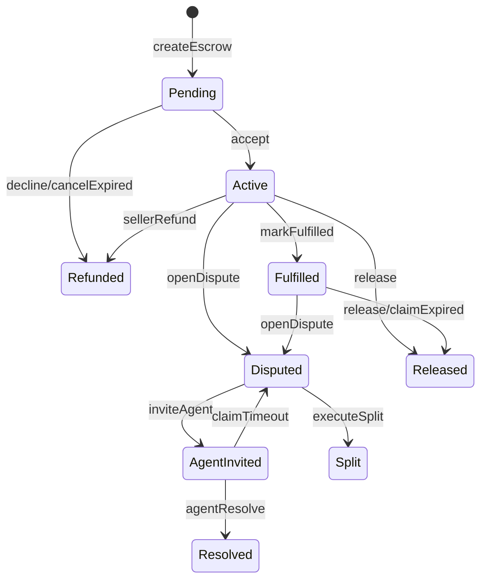

## System Overview

Zenland uses a modular smart contract architecture:



---

## Core Contracts

### EscrowFactory

The main entry point for creating escrows.

**Responsibilities:**
- Deploy new escrow clones (EIP-1167)
- Validate creation parameters
- Collect protocol fees
- Maintain `isEscrow` registry

**Key Functions:**
```solidity
function createEscrow(
    bytes32 userSalt,
    address seller,
    address agent,
    address token,
    uint256 amount,
    uint256 buyerProtectionTime,
    bytes32 termsHash,
    uint256 version,
    address expectedEscrow
) external returns (address);
```

### AgentRegistry

Manages agent registration, staking, and validation.

**Responsibilities:**
- Agent registration and deregistration
- Stake management (add/withdraw)
- MAV calculations
- Two-stage agent validation

**Key Functions:**
```solidity
function register(
    uint256 stablecoinAmount,
    uint256 tokenAmount,
    uint256 assignmentFeeBps,
    uint256 disputeFeeBps
) external;

function validateAgentForContract(
    address agent,
    uint256 contractValue
) external view returns (bool);
```

### FeeManager

Controls protocol fees and token whitelisting.

**Responsibilities:**
- Token whitelist management
- Fee configuration per token
- Fee quotation

**Key Functions:**
```solidity
function quoteCreationFee(
    address token,
    uint256 amount
) external view returns (uint256);
```

### EscrowImplementation

The template contract cloned for each escrow.

**Responsibilities:**
- Hold escrowed funds
- Enforce state machine
- Process releases, refunds, splits
- Handle dispute resolution

---

## Design Patterns

### Minimal Proxies (EIP-1167)

Each escrow is a lightweight clone:

```
Implementation: 2500+ lines of logic
Clone: Just 45 bytes pointing to implementation
Gas savings: ~90% on deployment
```

### CREATE2 Deterministic Addresses

Escrow addresses are predictable:

```solidity
salt = keccak256(abi.encodePacked(userSalt, buyer));
address = CREATE2(salt, cloneCode);
```

**Benefits:**
- PDF can include the address before creation
- User can verify they're funding the right contract

### Two-Stage Agent Validation

Agents are validated at:
1. **Creation:** Is agent valid for this escrow?
2. **Invite:** Is agent *still* valid when invited?

**Why?** Prevents agents from unstaking after being selected.

### Checks-Effects-Interactions

All state changes follow the pattern:
1. **Checks:** Validate inputs
2. **Effects:** Update state
3. **Interactions:** External calls last

---

## Trust Boundaries

### Factory-Escrow Trust

```
Factory maintains: isEscrow[address] = true
Escrows can call: Factory for validation
Other contracts: Untrusted
```

### Agent-Escrow Trust

```
Agent can: Resolve disputes for their assigned escrow
Agent cannot: Access other escrows
                Resolve without being invited
```

---

## State Machine

Escrow states and transitions:



---

## Security Considerations

<CardGroup cols={2}>
  <Card title="Reentrancy Protection" icon="shield">
    All state-changing functions use ReentrancyGuard
  </Card>
  <Card title="Safe ERC20" icon="lock">
    OpenZeppelin's SafeERC20 for all token operations
  </Card>
  <Card title="No Fee-On-Transfer Tokens" icon="ban">
    Whitelist excludes tokens with hidden fees
  </Card>
  <Card title="Immutable After Creation" icon="lock">
    Escrow rules cannot change after deployment
  </Card>
</CardGroup>

---

<Card title="Smart Contract Details" icon="file-code" href="/developers/smart-contracts">
  View detailed contract specs →
</Card>
