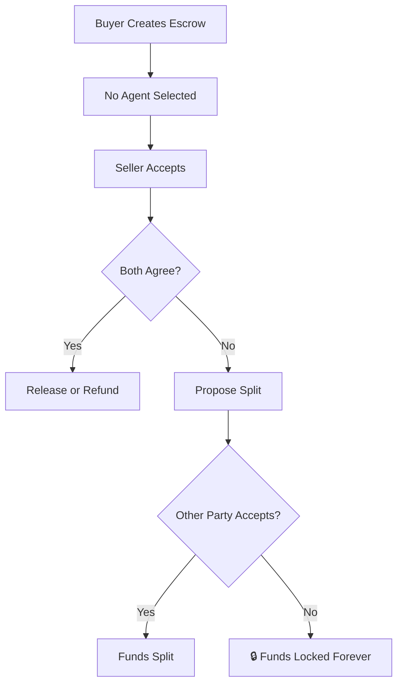

<Warning>
**Advanced users only.** Locked escrows have NO dispute resolution. Funds can be locked FOREVER if parties disagree.
</Warning>

## What is a Locked Escrow?

A **locked escrow** (also called "2-of-2 escrow") is created with **no agent selected**. This means:

- ✅ **Maximum trustlessness** — no third party can touch your funds
- ⚠️ **No dispute resolution** — if you disagree, there's no arbiter
- 🔒 **Permanent lock risk** — funds can be locked forever if you can't agree

This is Satoshi Nakamoto's original escrow design from 2010, based on pure game theory.

---

## How It Works



### Available Actions

| Action | Who Can Do It | Result |
|--------|---------------|--------|
| **Release** | Buyer | 100% to seller |
| **Refund** | Seller | 100% to buyer |
| **Propose Split** | Either | Suggest % distribution |
| **Accept Split** | Other party | Execute the split |

<Note>
There is NO unilateral action for the buyer to get funds back. Only the seller can refund.
</Note>

---

## The Game Theory

Locked escrows work because of **mutually assured destruction**:

<CardGroup cols={2}>
  <Card title="Seller Cheats" icon="user-ninja">
    ```
    Seller delivers nothing
    ↓
    Buyer refuses to release
    ↓
    Money burns (locked forever)
    ↓
    Seller gains $0
    ```
  </Card>
  <Card title="Buyer Cheats" icon="user-ninja">
    ```
    Buyer claims non-delivery
    ↓
    Seller refuses to refund
    ↓
    Money burns (locked forever)
    ↓
    Buyer gains $0
    ```
  </Card>
</CardGroup>

**The key insight:** Cheating has **zero expected value** because the other party can always burn the funds. This incentivizes honest behavior.

---

## When to Use Locked Escrow

<AccordionGroup>
  <Accordion title="OTC Crypto Trades" icon="coins">
    Trading large amounts with established partners you've worked with before.
  </Accordion>
  <Accordion title="High-Trust Relationships" icon="handshake">
    Business partners, friends, or repeat clients where trust is established.
  </Accordion>
  <Accordion title="Maximum Privacy" icon="eye-slash">
    When you don't want any third party to see transaction details.
  </Accordion>
  <Accordion title="Ideological Preference" icon="brain">
    When you philosophically prefer pure code over human arbitration.
  </Accordion>
</AccordionGroup>

---

## When NOT to Use Locked Escrow

<Warning>
Avoid locked escrows in these situations:
</Warning>

- ❌ **First-time transactions** with strangers
- ❌ **Subjective deliverables** (design, writing, etc.)
- ❌ **High-value transactions** you can't afford to lose
- ❌ **Emotional counterparties** who might act out of spite
- ❌ **Complex projects** with room for interpretation

---

## Real Risks to Understand

### Risk 1: Spite Burns

Even if you delivered perfectly, a bitter buyer might refuse to release just to hurt you.

```
Seller: "But I delivered exactly what we agreed!"
Buyer: "I don't care. I'd rather burn the money."
Result: Funds locked forever.
```

### Risk 2: Genuine Disagreement

Good-faith parties can disagree on quality or completeness.

```
Seller: "The website is done."
Buyer: "The contact form doesn't work."
Seller: "It works fine on my machine."
Result: Stalemate. No agent to decide who's right.
```

### Risk 3: Abandonment

Either party disappearing means funds are stuck.

```
Escrow funded → Seller accepts → Seller disappears
Result: Buyer can never get funds back.
```

---

## Stuck in a Locked Escrow?

If you're in a locked escrow dispute, your options are:

<Steps>
  <Step title="Communicate">
    Reach out to the other party. Many deadlocks resolve with conversation.
  </Step>
  <Step title="Propose Fair Split">
    Split the difference. Getting 50% is better than 0%.
  </Step>
  <Step title="Accept the Loss">
    If they won't respond, you may have to write it off.
  </Step>
</Steps>

<Info>
There is NO DAO escalation, NO support team, and NO way to recover funds from a locked escrow. This is by design.
</Info>

---

## Creating a Locked Escrow

If you understand the risks and want to proceed:

<Steps>
  <Step title="Create Escrow">
    Start creating an escrow normally
  </Step>
  <Step title="Agent Selection">
    When asked to select an agent, choose "No Agent"
  </Step>
  <Step title="Acknowledge Warning">
    You'll see a warning. Confirm you understand the risks.
  </Step>
  <Step title="Complete Creation">
    Fund the escrow as normal
  </Step>
</Steps>

---

## Comparison: Standard vs Locked

| Feature | Standard Escrow | Locked Escrow |
|---------|-----------------|---------------|
| **Agent** | Yes, pre-selected | None |
| **Dispute Resolution** | Agent decides | Mutual agreement only |
| **Permanent Lock Risk** | No | Yes |
| **Third-Party Trust** | Required | Not required |
| **Best For** | Most users | Power users, OTC |
| **Fees** | Protocol + Agent | Protocol only |

---

<Card title="Not sure? Use Standard" icon="shield-check" href="/escrow-types/standard-escrow">
  Standard escrows are recommended for most transactions →
</Card>
