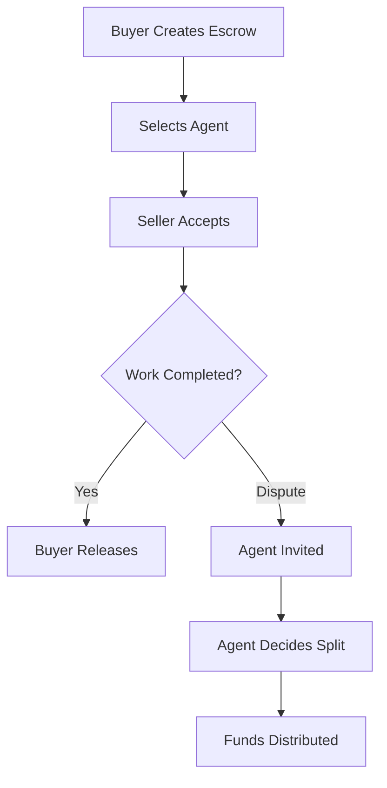

## What is a Standard Escrow?

A **standard escrow** is created with a pre-selected agent who can resolve disputes if buyer and seller disagree.

<Card title="Recommended for Most Users" icon="star">
  Standard escrows offer the best balance of security and flexibility. Even if you trust your counterparty, having an agent as backup is wise.
</Card>

---

## How It Works



### Key Features

<CardGroup cols={2}>
  <Card title="Professional Arbitration" icon="gavel">
    If you disagree, a qualified agent reviews the case and decides a fair outcome.
  </Card>
  <Card title="Stake-Backed Agents" icon="shield-check">
    Agents stake funds to ensure they act fairly. Misconduct = slashing.
  </Card>
  <Card title="MAV Protection" icon="coins">
    Agents can only handle escrows up to their Maximum Arbitratable Value (based on stake).
  </Card>
  <Card title="7-Day Timeout" icon="clock">
    If the agent is unresponsive, you can claim timeout and settle mutually.
  </Card>
</CardGroup>

---

## Choosing a Good Agent

When creating an escrow, you'll see a list of available agents. Here's what to look for:

### Reputation Metrics

| Metric | What It Means |
|--------|---------------|
| **Total Resolved** | How many disputes they've handled |
| **Registration Date** | How long they've been active |
| **Availability** | Whether they're accepting new cases |

### Fees

Agents charge two types of fees:

| Fee Type | When Charged | Typical Range |
|----------|--------------|---------------|
| **Assignment Fee** | When agent is selected at creation | 0-2% |
| **Dispute Fee** | Only if agent resolves a dispute | 1-10% |

<Tip>
Lower fees aren't always better. Experienced agents with higher fees may provide better resolution.
</Tip>

### Stake and MAV

Agents must stake funds to participate:

- **Stablecoin Stake:** Determines their MAV (Maximum Arbitratable Value)
- **DAO Token Stake:** Shows alignment with the protocol

```
Example:
- Agent stakes $1,000 in USDC
- MAV multiplier is 20x
- Agent can handle escrows up to $20,000
```

<Note>
Your escrow amount must be within the agent's MAV for them to be eligible.
</Note>

---

## The Dispute Flow

If something goes wrong:

<Steps>
  <Step title="Buyer Opens Dispute">
    Signals that there's a problem with the delivery
  </Step>
  <Step title="Either Party Invites Agent">
    At invite time, the agent's eligibility is re-verified
  </Step>
  <Step title="Agent Reviews Evidence">
    Both parties submit their case
  </Step>
  <Step title="Agent Sets Split">
    Decides what % goes to buyer vs seller
  </Step>
  <Step title="Automatic Distribution">
    Agent fee deducted first, then funds distributed
  </Step>
</Steps>

---

## Benefits of Standard Escrows

<AccordionGroup>
  <Accordion title="Protects Against Bad Faith" icon="shield">
    If one party tries to cheat, the agent provides an impartial resolution.
  </Accordion>
  <Accordion title="Faster Resolution" icon="bolt">
    Don't need to negotiate endlessly. Agent decides within days.
  </Accordion>
  <Accordion title="Lower Risk" icon="life-ring">
    Funds can never be locked forever — there's always a path to resolution.
  </Accordion>
  <Accordion title="Reputation Building" icon="star">
    Good behavior is recorded. Build a track record for future transactions.
  </Accordion>
</AccordionGroup>

---

## When NOT to Use Standard Escrow

Consider a [locked escrow](/escrow-types/locked-escrow) instead if:

- You have **absolute trust** in your counterparty
- You're doing **OTC trades** with established partners
- You want **maximum trustlessness** (no third party at all)
- You understand and accept the risk of funds being locked forever

<Card title="Compare Escrow Types" icon="scale-balanced" href="/escrow-types/locked-escrow">
  Learn about locked escrows →
</Card>
