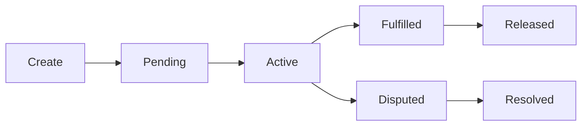

## The Escrow Lifecycle

Every Zenland escrow follows a clear lifecycle. Here's what happens at each stage:

---

## Step 1: Create the Escrow

<Steps>
  <Step title="Agree on Terms">
    Buyer and seller discuss and agree on the work, price, and timeline off-chain (chat, email, etc.)
  </Step>
  <Step title="Generate Contract PDF">
    The Zenland app generates a PDF containing all terms. This gets hashed and stored on-chain.
  </Step>
  <Step title="Choose an Agent (Optional)">
    Select a professional dispute resolver, or go "locked" for pure 2-of-2 escrow.
  </Step>
  <Step title="Fund the Escrow">
    Buyer deposits funds + pays the 1% protocol fee. Funds are now locked in the smart contract.
  </Step>
</Steps>

<Note>
The escrow address is **deterministic** — it's known before you even create it! This address is embedded in your PDF for verification.
</Note>

---

## Step 2: Seller Accepts

Once the escrow is funded, the seller must **accept** the contract to activate it:

- **Accept** — Seller agrees to the terms, escrow becomes `ACTIVE`
- **Decline** — Seller rejects, buyer is refunded immediately
- **No Response** — After the acceptance window, buyer can cancel and get refunded

<Warning>
If you're a seller, always review the terms carefully before accepting. Once active, you're committed to delivering.
</Warning>

---

## Step 3: Do the Work

With the escrow active:

1. **Seller** delivers the goods or completes the service
2. **Seller** marks the escrow as `Fulfilled` when done
3. **Buyer** reviews the delivery

<Tip>
Communication is key! Use your preferred channel (Telegram, email, etc.) to stay in sync with the other party.
</Tip>

---

## Step 4: Settlement

The escrow can settle in several ways:

### Happy Path: Release

The buyer is satisfied and releases 100% of funds to the seller. Instant, no fees beyond the creation fee.

### Seller-Initiated Refund

The seller can **always** refund 100% to the buyer at any time. No approval needed. Use this for "no questions asked" returns.

### Auto-Release (Buyer Protection Expiry)

If the buyer doesn't respond after the protection period ends (and seller marked fulfilled), the seller can claim the funds.

### Mutual Split

Both parties agree to divide the funds. Propose a split (e.g., 60/40), the other party approves, funds are distributed.

---

## When Things Go Wrong: Disputes

If there's a disagreement:

<Steps>
  <Step title="Open Dispute">
    The buyer opens a dispute, pausing normal settlement.
  </Step>
  <Step title="Invite Agent">
    Either party invites the pre-selected agent to review the case.
  </Step>
  <Step title="Agent Resolves">
    The agent reviews evidence and decides the split. Agent fee is deducted.
  </Step>
</Steps>

<Card title="Learn about disputes" icon="gavel" href="/user-guides/resolving-disputes">
  See the full dispute resolution process →
</Card>

---

## Summary: State Transitions

| State | Description | Next States |
|-------|-------------|-------------|
| **Pending** | Escrow created, waiting for seller | Active, Refunded |
| **Active** | Seller accepted, work in progress | Fulfilled, Disputed, Released, Refunded |
| **Fulfilled** | Seller marked as complete | Released, Disputed |
| **Disputed** | Buyer raised an issue | Agent Invited, Split, Refunded |
| **Agent Invited** | Waiting for agent decision | Resolved, Split, Refunded |
| **Released** | Funds sent to seller ✓ | *Terminal* |
| **Refunded** | Funds returned to buyer ✓ | *Terminal* |
| **Split** | Funds divided between parties ✓ | *Terminal* |
