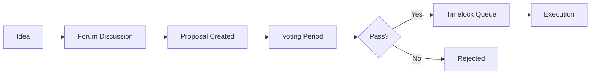

## Community Owned

Zenland is a **Decentralized Autonomous Organization (DAO)**. This means:

<CardGroup cols={2}>
  <Card title="No Central Authority" icon="building-columns">
    No company controls Zenland. The protocol is governed by token holders.
  </Card>
  <Card title="Transparent Governance" icon="scale-balanced">
    All proposals and votes happen on-chain, visible to everyone.
  </Card>
</CardGroup>

---

## How Governance Works



### Governance Flow

1. **Discussion:** Ideas are discussed in the DAO forum
2. **Proposal:** Token holder creates on-chain proposal
3. **Voting:** 7-day voting period
4. **Timelock:** 2-day delay before execution (safety period)
5. **Execution:** Changes are applied automatically

---

## What Can the DAO Control?

### Protocol Parameters

| Parameter | Example |
|-----------|---------|
| Protocol fee | Change from 1% to 0.75% |
| Fee min/max | Adjust $0.50 min or $50 max |
| Token whitelist | Add new supported tokens |
| Agent requirements | Modify minimum stakes |

### Treasury

| Action | Example |
|--------|---------|
| Fund development | Grant to build features |
| Security audits | Pay for professional review |
| Community programs | Rewards, incentives, events |

### Agent Oversight

| Action | Example |
|--------|---------|
| Slash bad actors | Penalize proven misconduct |
| Update MAV multiplier | Change 20x to 15x |
| Fee bounds | Adjust agent fee limits |

### Upgrades

| Action | Example |
|--------|---------|
| Factory upgrade | Deploy improved factory |
| Implementation upgrade | New escrow features |
| New contracts | Add new protocol modules |

---

## Key Roles

<AccordionGroup>
  <Accordion title="Token Holders" icon="coins">
    Anyone holding Zenland DAO tokens can vote on proposals proportional to their holdings.
  </Accordion>
  <Accordion title="Delegates" icon="user-check">
    Token holders can delegate their voting power to trusted community members.
  </Accordion>
  <Accordion title="Proposal Creators" icon="plus">
    Anyone with enough tokens (proposal threshold) can create on-chain proposals.
  </Accordion>
  <Accordion title="Timelock Admin" icon="clock">
    The timelock contract executes passed proposals after the delay period.
  </Accordion>
</AccordionGroup>

---

## Voting Power

Your voting power = your token balance at the snapshot block.

<Note>
Remember to delegate your tokens to yourself or someone else to activate voting power!
</Note>

```
Self-delegate: You vote directly
Delegate to X: X votes on your behalf
```

---

## Safety Mechanisms

<CardGroup cols={2}>
  <Card title="Timelock Delay" icon="clock">
    2-day delay between vote passing and execution. Gives time to react.
  </Card>
  <Card title="Quorum" icon="users">
    Minimum participation required for votes to be valid.
  </Card>
  <Card title="Voting Period" icon="calendar">
    7 days to vote ensures broad participation.
  </Card>
  <Card title="Threshold" icon="arrow-up">
    Minimum tokens needed to create proposals prevents spam.
  </Card>
</CardGroup>

---

## Get Involved

<Steps>
  <Step title="Get Tokens">
    Acquire Zenland DAO tokens
  </Step>
  <Step title="Delegate">
    Delegate to yourself to activate voting power
  </Step>
  <Step title="Join Forum">
    Participate in governance discussions
  </Step>
  <Step title="Vote">
    Cast your vote on active proposals
  </Step>
</Steps>

<Card title="DAO Token" icon="coins" href="/governance/dao-token">
  Learn about the token →
</Card>
