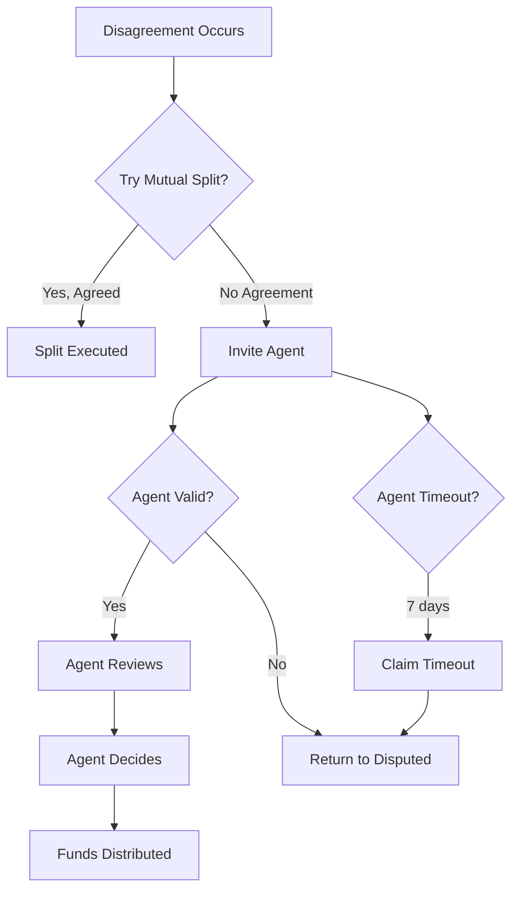

## Multi-Layer Protection

Dispute resolution in Zenland has multiple security layers:



---

## Agent Staking

Agents must **stake funds** to participate:

### Dual Staking Model

| Stake Type | Purpose | Amount |
|------------|---------|--------|
| **Stablecoin Stake** | Determines MAV (max value they can judge) | Min ~$100 equivalent |
| **DAO Token Stake** | Shows protocol alignment | Min ~100 tokens |

### How MAV Works

```
Agent stakes: $1,000 USDC
MAV multiplier: 20x
Max escrow they can handle: $20,000

Your escrow: $15,000
→ Agent is eligible ✓

Your escrow: $25,000
→ Agent cannot be selected ✗
```

---

## Protection Against Agent Attacks

### Attack: Agent Unstakes After Selection

**Scenario:** Agent is selected, then unstakes before dispute, then colludes for a bribe.

**Protection:**
1. Agent eligibility is re-checked at *invite time* (not just creation)
2. `activeCases` counter prevents unstaking during disputes
3. 30-day cooldown after last case before unstaking allowed

### Attack: Agent Colludes with One Party

**Scenario:** Agent takes a bribe to rule unfairly.

**Protection:**
1. Economic: Bribe must exceed stake value (at risk of slashing)
2. Reputation: Bad decisions visible on-chain, affect future selection
3. DAO: Token holders can vote to slash bad agents

### Attack: Agent Goes Inactive

**Scenario:** Agent stops responding to requests.

**Protection:**
1. 7-day timeout after invite
2. Either party can claim timeout
3. Escrow returns to disputed with no agent
4. Parties settle via mutual split

---

## Two-Stage Agent Validation

Agents are validated at two checkpoints:

<Steps>
  <Step title="At Creation (Factory)">
    - Is this agent registered?
    - Is their MAV sufficient?
    - Are they active and available?
    
    *If fails: Cannot create escrow with this agent*
  </Step>
  <Step title="At Invite (Escrow)">
    - Is agent still registered?
    - Is MAV still sufficient?
    - Are they still active and available?
    
    *If fails: inviteAgent() reverts*
  </Step>
</Steps>

<Note>
This two-stage validation prevents "nothing to lose" attacks where agents unstake between creation and dispute.
</Note>

---

## Seller Refund Escape Hatch

Even in disputes, the seller can always refund:

<Card title="sellerRefund()" icon="undo">
  Seller can return 100% to buyer at any time — no approval needed.
</Card>

This provides an ultimate escape:
- Agent is unresponsive? Seller can refund.
- Dispute is taking too long? Seller can refund.
- Seller made a mistake? Seller can refund.

---

## Locked Escrow Considerations

For locked escrows (no agent):

<Warning>
There is NO third-party intervention. Security comes purely from game theory.
</Warning>

| Protection | Standard Escrow | Locked Escrow |
|------------|-----------------|---------------|
| Agent arbitration | ✓ | ✗ |
| Seller refund | ✓ | ✓ |
| Mutual split | ✓ | ✓ |
| Timeout protection | ✓ | ✗ |
| Permanent lock risk | ✗ | ✓ |

---

## DAO Oversight

The DAO provides backstop governance:

- **Slash bad agents** for proven misconduct
- **Adjust parameters** (fees, timeouts, minimums)
- **Blacklist tokens** that behave maliciously
- **Upgrade factory** for future escrows

<Info>
The DAO cannot intervene in individual disputes or override agent decisions. This is by design for decentralization.
</Info>

---

<Card title="Learn About Agents" icon="gavel" href="/agents/what-is-an-agent">
  Understand the agent system →
</Card>
