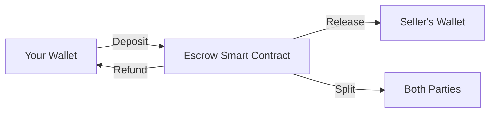

## Non-Custodial by Design

<Card title="Zenland Never Holds Your Funds" icon="shield-check">
  When you create an escrow, funds go directly to a smart contract — not to Zenland.
</Card>

This means:
- ✅ **No company** can access your funds
- ✅ **No employee** can steal or freeze your money
- ✅ **No server hack** can compromise your escrow
- ✅ **No government** can seize funds without your keys

---

## How It Works

The smart contract:
- **Holds funds** according to programmed rules
- **Only releases** when conditions are met
- **Cannot be changed** after deployment
- **Is fully auditable** by anyone

---

## Security Layers

### Layer 1: Smart Contract Safety

<CardGroup cols={2}>
  <Card title="Minimal Proxies (EIP-1167)" icon="clone">
    Each escrow is a lightweight clone of the audited implementation.
  </Card>
  <Card title="Reentrancy Guards" icon="shield">
    Protection against reentrancy attacks on all state-changing functions.
  </Card>
  <Card title="SafeERC20" icon="lock">
    OpenZeppelin's safe transfer library prevents token-related exploits.
  </Card>
  <Card title="Checks-Effects-Interactions" icon="list-check">
    State changes happen before external calls to prevent manipulation.
  </Card>
</CardGroup>

### Layer 2: Protocol Safety

<CardGroup cols={2}>
  <Card title="CREATE2 Addresses" icon="fingerprint">
    Escrow addresses are deterministic — you know where funds go before sending.
  </Card>
  <Card title="Atomic Operations" icon="atom">
    Escrow creation and funding happen in one transaction. No front-running.
  </Card>
  <Card title="State Machine" icon="diagram-project">
    Clear state transitions prevent invalid operations.
  </Card>
  <Card title="Token Whitelist" icon="filter">
    Only DAO-approved tokens are supported. No weird token exploits.
  </Card>
</CardGroup>

### Layer 3: Trust Boundaries

<CardGroup cols={2}>
  <Card title="Factory Registry" icon="building">
    Only escrows created by the official factory are recognized.
  </Card>
  <Card title="Agent Validation" icon="user-check">
    Agents are re-validated when invited to prevent stake manipulation.
  </Card>
</CardGroup>

---

## What Could Go Wrong (And How We Handle It)

<AccordionGroup>
  <Accordion title="Malicious token contracts" icon="virus">
    **Risk:** Tokens with hooks, fees, or rebasing could exploit escrows.
    
    **Mitigation:** Only whitelisted stablecoins (USDC, USDT) are supported. Fee-on-transfer and rebasing tokens are explicitly blocked.
  </Accordion>
  <Accordion title="Front-running attacks" icon="person-running">
    **Risk:** Someone could front-run your escrow creation.
    
    **Mitigation:** CREATE2 salt includes your address, so only you can deploy to your predicted address.
  </Accordion>
  <Accordion title="Agent collusion" icon="handshake">
    **Risk:** Agent could collude with one party.
    
    **Mitigation:** Agents stake funds (5% of MAV minimum). Misbehavior = slashing by DAO.
  </Accordion>
  <Accordion title="Smart contract bugs" icon="bug">
    **Risk:** Bugs could lock or drain funds.
    
    **Mitigation:** Contracts are thoroughly tested and audited. Immutable escrows can't be "patched" after deployment.
  </Accordion>
</AccordionGroup>

---

## Immutability

Once your escrow is created:

- **The rules can't change** — your escrow follows the version it was created with
- **No admin backdoor** — there's no function to drain funds
- **DAO upgrades don't affect you** — only new escrows use new code

<Note>
This is intentional. Immutability is a feature, not a bug. It means you can trust the code.
</Note>

---

## Best Practices for Users

<CardGroup cols={2}>
  <Card title="Verify the Address" icon="magnifying-glass">
    Check that the escrow address matches what's in your PDF contract.
  </Card>
  <Card title="Use the Official App" icon="globe">
    Always use zen.land. Bookmark it to avoid phishing sites.
  </Card>
  <Card title="Keep Your Keys Safe" icon="key">
    Your wallet is your escrow access. Protect your seed phrase.
  </Card>
  <Card title="Understand the Terms" icon="file-contract">
    Read the escrow terms before funding. The smart contract enforces them exactly.
  </Card>
</CardGroup>

---

<Card title="View Security Audit" icon="file-shield" href="/security/audit-status">
  Learn about our security audits →
</Card>
