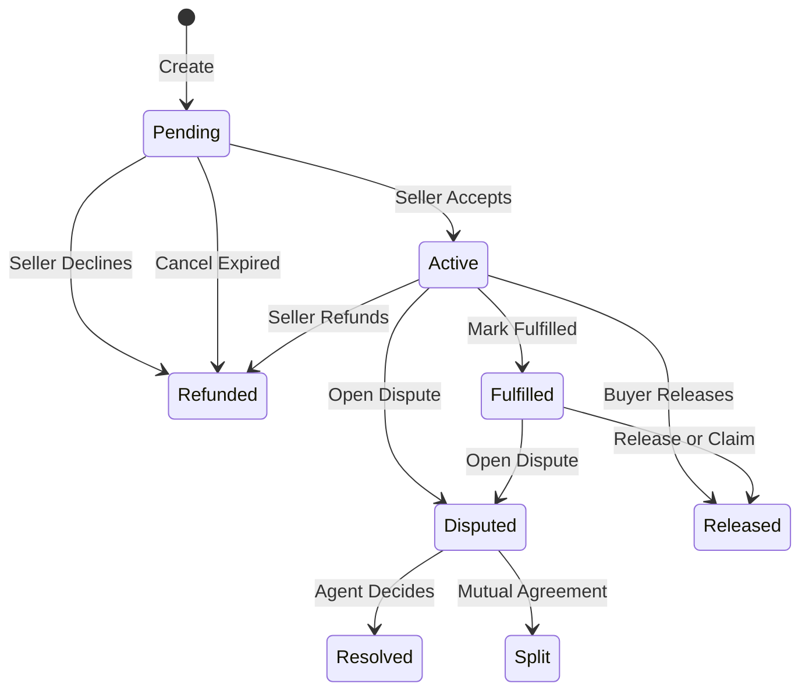

## Escrow States Overview

Your escrow will pass through different states. Here's what you can do at each:

---

## Actions by State

### Pending State

The escrow has been created but the seller hasn't accepted yet.

<CardGroup cols={2}>
  <Card title="For Buyers" icon="user">
    - Wait for seller to accept
    - Cancel if seller doesn't respond (after expiry)
  </Card>
  <Card title="For Sellers" icon="store">
    - Review the terms carefully
    - Accept to start working
    - Decline if terms are wrong
  </Card>
</CardGroup>

---

### Active State

Seller accepted. Work is in progress!

<Tabs>
  <Tab title="Buyer Actions">
    | Action | Description |
    |--------|-------------|
    | **Release** | Send 100% to seller (anytime) |
    | **Open Dispute** | Raise an issue with the work |
    | **Propose Split** | Suggest dividing the funds |
  </Tab>
  <Tab title="Seller Actions">
    | Action | Description |
    |--------|-------------|
    | **Mark Fulfilled** | Signal that work is complete |
    | **Refund** | Return 100% to buyer (no approval needed) |
    | **Propose Split** | Suggest dividing the funds |
  </Tab>
</Tabs>

---

### Fulfilled State

Seller has marked the work as complete. The clock is ticking!

<Warning>
**Buyers:** Review promptly! After the protection time expires, the seller can claim the funds.
</Warning>

<Tabs>
  <Tab title="Buyer Actions">
    | Action | Description |
    |--------|-------------|
    | **Release** | Send funds to seller (you're satisfied) |
    | **Open Dispute** | Something is wrong with delivery |
    | **Propose Split** | Negotiate a partial refund |
  </Tab>
  <Tab title="Seller Actions">
    | Action | Description |
    |--------|-------------|
    | **Claim** (after expiry) | Take funds if buyer is unresponsive |
    | **Refund** | Return 100% to buyer |
    | **Propose Split** | Negotiate a resolution |
  </Tab>
</Tabs>

---

### Disputed State

A dispute has been opened. Normal settlement is paused.

<CardGroup cols={2}>
  <Card title="Invite Agent" icon="gavel">
    Either party can invite the pre-selected agent to resolve the dispute.
  </Card>
  <Card title="Propose Split" icon="divide">
    Or try to settle mutually without involving the agent.
  </Card>
</CardGroup>

<Note>
Even during a dispute, the seller can still refund 100% or both parties can agree to a split.
</Note>

---

### Agent Invited State

The agent is reviewing the case.

<Tabs>
  <Tab title="What to Do">
    - **Present your case** — Share evidence with the agent
    - **Respond promptly** — Agents may have questions
    - **Be honest** — Agents can detect bad-faith behavior
  </Tab>
  <Tab title="What Happens">
    - Agent reviews evidence from both parties
    - Agent decides the split (e.g., 60% buyer, 40% seller)
    - Agent fee is deducted from the total
    - Funds are distributed automatically
  </Tab>
</Tabs>

<Warning>
**Agent Timeout:** If the agent doesn't respond within 7 days, either party can claim timeout. The escrow returns to disputed state with no agent (locked mode).
</Warning>

---

## The Split Negotiation Flow

Splits are a powerful way to settle without agent involvement:

<Steps>
  <Step title="Propose">
    Either party proposes a split (e.g., "70% to me, 30% to you")
  </Step>
  <Step title="Review">
    The other party sees the proposal in their dashboard
  </Step>
  <Step title="Respond">
    They can:
    - **Accept** — Funds are distributed immediately
    - **Counter** — Propose different percentages
    - **Ignore** — Proposal stays pending
  </Step>
  <Step title="Execute">
    When both parties agree on the same split, it executes automatically
  </Step>
</Steps>

<Tip>
Proposing a split is free! It doesn't commit you to anything until the other party accepts.
</Tip>

---

## Terminal States

These are the final states — the escrow is complete:

| State | Meaning |
|-------|---------|
| **Released** | Full amount sent to seller |
| **Refunded** | Full amount returned to buyer |
| **Split** | Amount divided between parties |
| **Agent Resolved** | Agent determined the split |

Once in a terminal state, no further actions are possible.

---

## Tips for Smooth Escrows

<AccordionGroup>
  <Accordion title="For Buyers" icon="cart-shopping">
    - Review deliveries promptly to keep the seller happy
    - Communicate clearly about what's missing before disputing
    - Release funds quickly when satisfied — it builds trust
  </Accordion>
  <Accordion title="For Sellers" icon="store">
    - Mark fulfilled only when everything is truly complete
    - Communicate any delays before they become problems
    - Don't be afraid to refund if you can't deliver
  </Accordion>
  <Accordion title="For Both" icon="users">
    - Document everything in writing
    - Use the protection time wisely
    - Try mutual settlement before invoking agents
  </Accordion>
</AccordionGroup>
